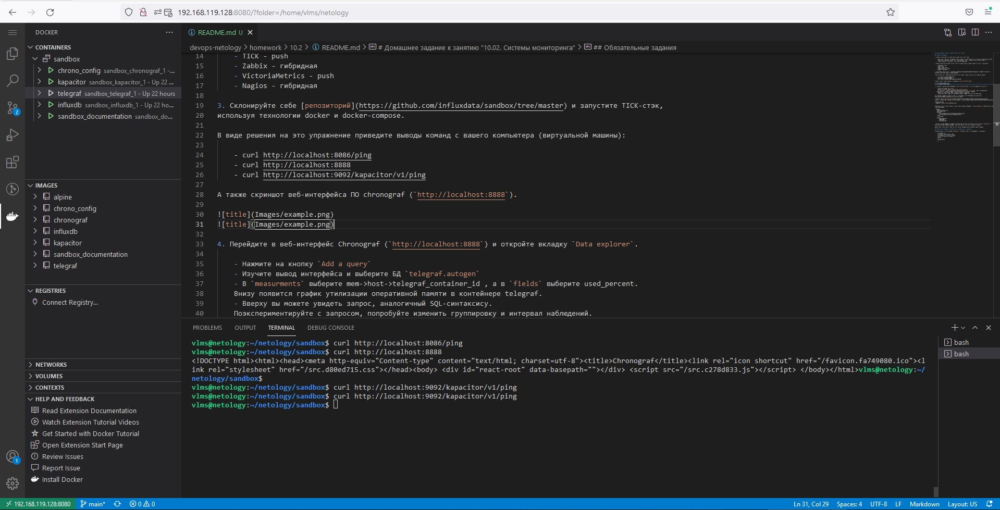
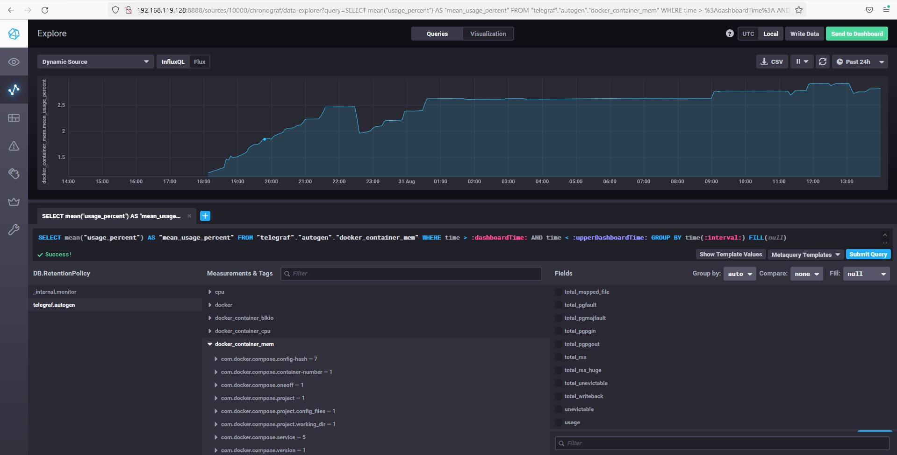

# Домашнее задание к занятию "10.02. Системы мониторинга"

## Обязательные задания

1. Опишите основные плюсы и минусы pull и push систем мониторинга.

    - push-модель работает через UDP(не гарантированная доставка данных), pull работает преимущественно по TCP
    - pull-модель использует единый сервер конфигурации, на котором задаются настройки для агентов
    - в pull-модели есть возможность настройки шифрования(TLS)

2. Какие из ниже перечисленных систем относятся к push модели, а какие к pull? А может есть гибридные?

    - Prometheus - pull
    - TICK - push
    - Zabbix - гибридная
    - VictoriaMetrics - push
    - Nagios - гибридная

3. Склонируйте себе [репозиторий](https://github.com/influxdata/sandbox/tree/master) и запустите TICK-стэк, 
используя технологии docker и docker-compose.

В виде решения на это упражнение приведите выводы команд с вашего компьютера (виртуальной машины):

    - curl http://localhost:8086/ping
    - curl http://localhost:8888
    - curl http://localhost:9092/kapacitor/v1/ping

А также скриншот веб-интерфейса ПО chronograf (`http://localhost:8888`). 

